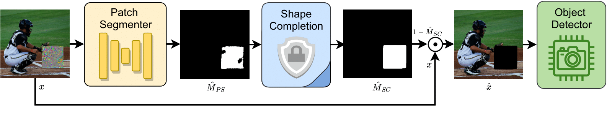
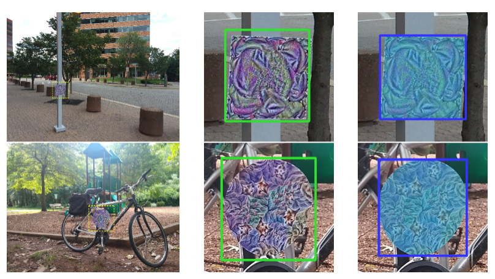

# Segment and Complete (SAC)
Welcome to the official implementation for the CVPR2022 paper [Segment and Complete: Defending Object Detectors against Adversarial Patch Attacks with Robust Patch Detection](https://openaccess.thecvf.com/content/CVPR2022/papers/Liu_Segment_and_Complete_Defending_Object_Detectors_Against_Adversarial_Patch_Attacks_CVPR_2022_paper.pdf). 
Feel free contact me if you have any question and sorry for the waiting :)




## Installation
Install the required packages by:
```commandline
conda env create -f environment.yml
```

## Usage

### Download the dataset
We use 1000 images randomly selected from [COCO](https://cocodataset.org/) `val2017` subset for evaluation. 
We provide the processed data for evaluating square patch attacks of different sizes [here](https://drive.google.com/drive/folders/1o9Ftkh6ecR2DcoRL3ae3ZjFeYOsXBCdp?usp=sharing).
Please download and extract them to `./data` if you want to run the evaluation pipeline.

### Run the evaluation pipeline
We provide the [eval_coco.sh](./eval_coco.sh) script for running the evaluation. 
```commandline
mkdir evaluation
conda activate sac
bash eval_coco.sh ${GPU_ID} ${PATCH_SIZE}
```
For example, to run the evaluation on gpu 0 with 100x100 patches, the last command should be:
```commandline
bash eval_coco.sh 0 100
```

### Use SAC alone 
You can easily integrate SAC in your own defense codebase. For example:

```python
from patch_detector import PatchDetector
import torch

SAC_processor = PatchDetector(3, 1, base_filter=16, square_sizes=[125, 100, 75, 50, 25], n_patch=1)
SAC_processor.unet.load_state_dict(torch.load("ckpts/coco_at.pth", map_location='cpu'))

# x: list [] of input images of shape 3xHxW with values normalized to [0, 1]
x_processed, _, _ = SAC_processor(x, bpda=True, shape_completion=True)
```


## APRICOT-Mask dataset
We present the APRICOT-Mask dataset, which
augments the [APRICOT](https://apricot.mitre.org/) dataset with pixel-level annotations
of adversarial patches. We hope APRICOT-Mask along with
the APRICOT dataset can facilitate the research in building
defenses against physical patch attacks, especially patch
detection and removal techniques. 



The detail of the APRICOT-Mask dataset can be found [here](https://aiem.jhu.edu/datasets/apricot-mask/). 
The dataset can be downloaded by the following command:

```commandline
wget -r ftp://ftp.cis.jhu.edu/pub/apricot-mask
```


## Citation

Please cite our paper if you find this repository helpful :)

```bibtex
@inproceedings{liu2022segment,
  title={Segment and Complete: Defending Object Detectors against Adversarial Patch Attacks with Robust Patch Detection},
  author={Liu, Jiang and Levine, Alexander and Lau, Chun Pong and Chellappa, Rama and Feizi, Soheil},
  booktitle={Proceedings of the IEEE/CVF Conference on Computer Vision and Pattern Recognition},
  pages={14973--14982},
  year={2022}
}
```
